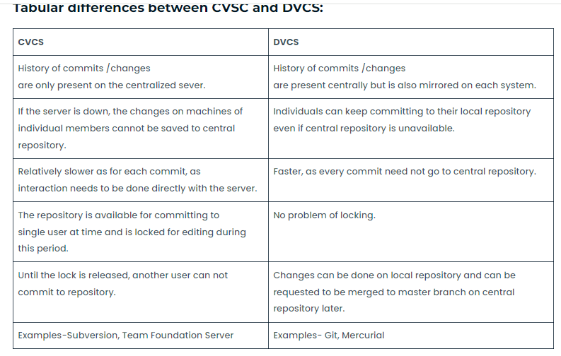
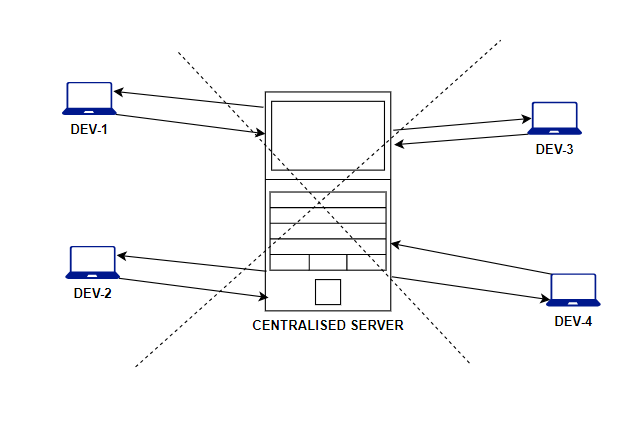
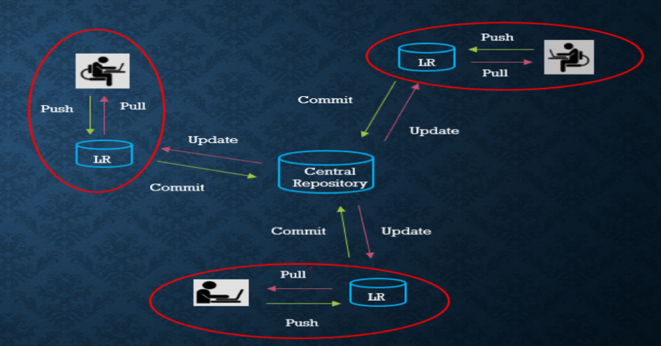

### GIT: GLOBAL INFORMATION TRACKER.
### Types of version control system
* Version control system are two types
   * centralized version control system
   * decentralised or Distributed version control system

### centralized version control system
   * The name itself indicates that, this type contains only one central repository and every 
     developer should be connected to that repository.
   * The total project code will be stored in the central repository.
   * If 4 developers are there, still we have only one repository.
      
### Problems with Centralized VCSs:
   * 1) Central Repository is the only place   where everything is stored, which causes single 
point of failure. If something goes wrong to the central repository then recovery is 
very difficult.   
  * 2) All commit and checkout operations should be performed by connecting to the central 
repositoty via network. If network outage, then no version control to the developer. 
i.e in this type, developer work space and remote repository server should be 
connected always .
  * 3) All commit and checkout operations should be performed by connecting to the central 
repositoty via network. If network outage, then no version control to the developer. 
i.e in this type, developer work space and remote repository server should be 
connected always.
 
  * 4) All commit and checkout operations should be performed by connecting to the central 
repositoty via network and hence these operations will become slow, which causes 
performance issues. No local operations and every version control operation should be 
remote operation.

### Distributed Version Control Systems:
  * The name itself indicates the respository is distributed and every developers workspace 
contains a local copy of the repository. There is no question of central repository. 
  * If 4 developers are there then 4 repositories will be there.
  
1) The checkout and commit operations will be performed locally. Hence performance is 
more.
2) To perform checkout and commit operations network is not required. Hence if there is 
any network outage, still version control is applicable.
3) If something goes wrong to any repository there is a chance to recover. There is no 
question of single point of failure.
4) To perform push and pull operations network must be required, but these operations 
are not most common operations and we are performing very rarely.

### GIT ARCHITECHTURE
  
### LIFECYCLE OF FILE IN GIT
  

# VCS: VERSION CONTROL SYSTEM
* it will keep the code separately for each version.

* v-1	: 100 lines --- > store (repo-1)
* v-2	: 200 lines --- > store (repo-2)
* v-3	: 300 lines --- > store (repo-3)

#### REPO: It is a folder where we store our code.
index.html: it is a basic file for every application

v1 --- > index.html
v2 --- > index.html
v3 --- > index.html 

INTRO:
Git is used to track the files.
It will maintain multiple versions of the same file.
It is platform-independent.
It is free and open-source.
They can handle larger projects efficiently.
It is 3rd generation of vcs.
it is written on c programming
it came on the year 2005

CVCS: CENTRALIZED VERSION CONTROL SYSTEM
EX: SVN: it can store code on a single repo.

DVCS: DISTRIBUTED VERSION CONTROL SYSTEM
EX: GIT: it can store code on Multiple repo.

ROLLBACK: Going back to the previous version of the application.

WORKING WITH GIT:
create a ec2 server:
mkdir swiggy
cd swiggy

yum install git -y  [yum=pkg manager, install=action, git=pkg name -y=yes]
git -v	: to check version
git init : to install .git (local repo)

To create file	: vim index.html (content is opt)
to check status	: git status
to track file	: git add index.html
to check status	: git status
to store file	: git commit -m "commit-1" index.html

create a file -- > add -- > commit 

to show commits	: git log
to show	last 2 commits: git log -2
to show commits in single line: git log -2 --oneline

=================================================

CONFIGURING USER AND EMAIL:

git config user.name "raham"
git config user.email "raham@gmail.com"

NOTE: this user and email will be replicated to new commits only.

Git show: used to show the files which are attached to commits.
git log --online
git show commit_id

###  STAGES:
# WORKING DIRECTORY:
* where we write our source code.
# STAGING AREA:
* we track files here.
# REPOSITORY:
* where we store tracked source code

* GIT RESTORE: to untrack the tracked file
 touch raham
 git status
 git add
 git status
 git restore --staged raham
 git status

### Changing from commited code to staging area
* if i want to back commit then i hae to use git reset or git revert coomand
* git revert <commit id>
* git reset --hard <commit id>
### deleting commit from remote

### DIFFRENCE B/W Revert && reset
* when we use revert command one extra revert commit id is genrated in future if i want to switch that coomit we can easily switch but in reset command we can not .
* genraly we use git reset in our local area that is our laptop . not in remote.
* git revert is use remote where devloper pull our code and working on code .

