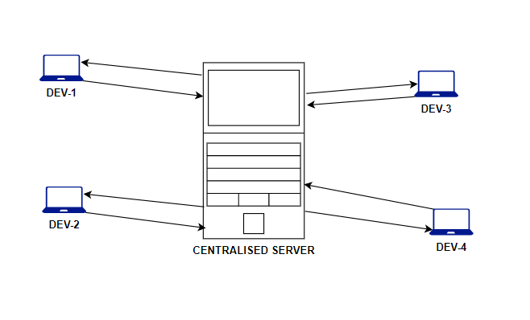

### **Git :**
***
* ###  Before we go to start details discustion about git let's know about version control system.
## **Version Control System :**
~~~
 Version control system are two types. 
   1. Centralized Version Control. ( )
   2. Distributed Version Control.
~~~
**Centralized Version Control System:**
> * 
```
PROBLEM
  single point of failure.
  defficult to collabrate.
```

### **Distributed version control system :**


